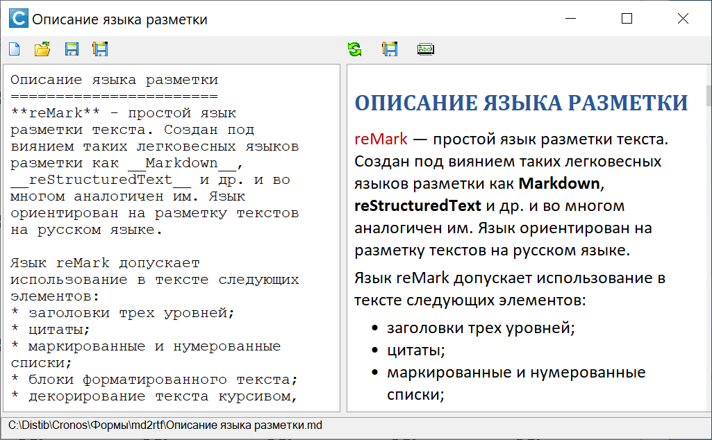

# reMark 
Модуль преобразования предварительно размеченного текста в формат RTF для последующего  
отображения в элементе **TextBox** на форме.

[Описание языка разметки](https://github.com/sinilga/ReMark/wiki)

### Пример использования

``` lua
function show_info(text)
	local rmk = require "reMark"
	Me.textbox1.Text = ""
	Me.textbox1.RTFMode = true
	Me.textbox1.SelectedTextRTF = rmk.makeRTF(text)
end
```

